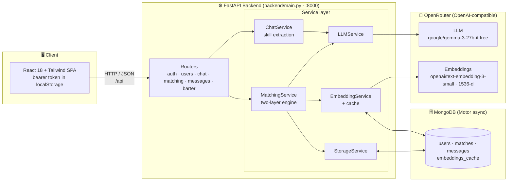
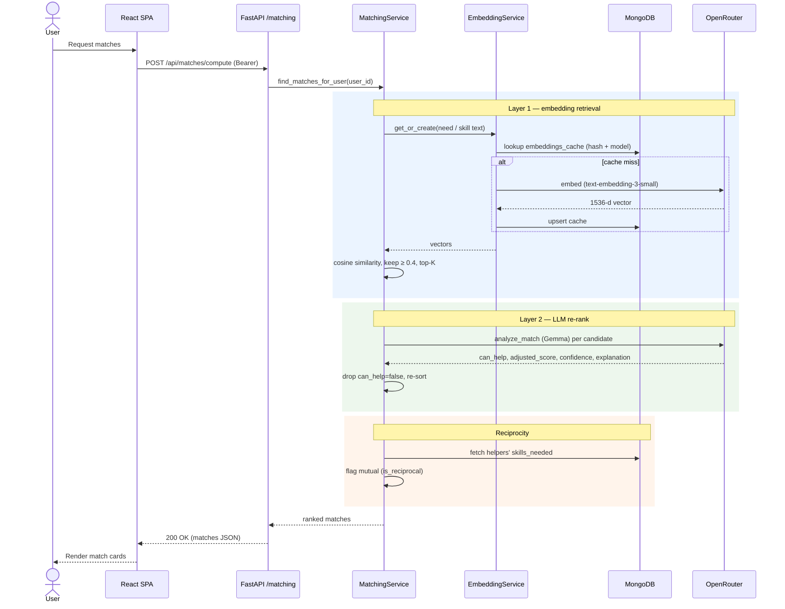
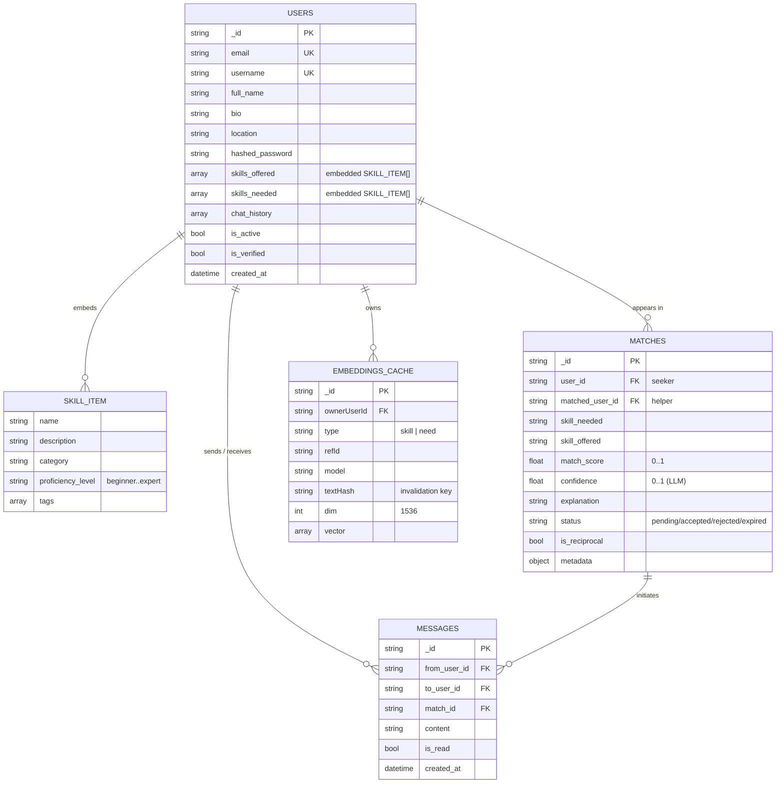
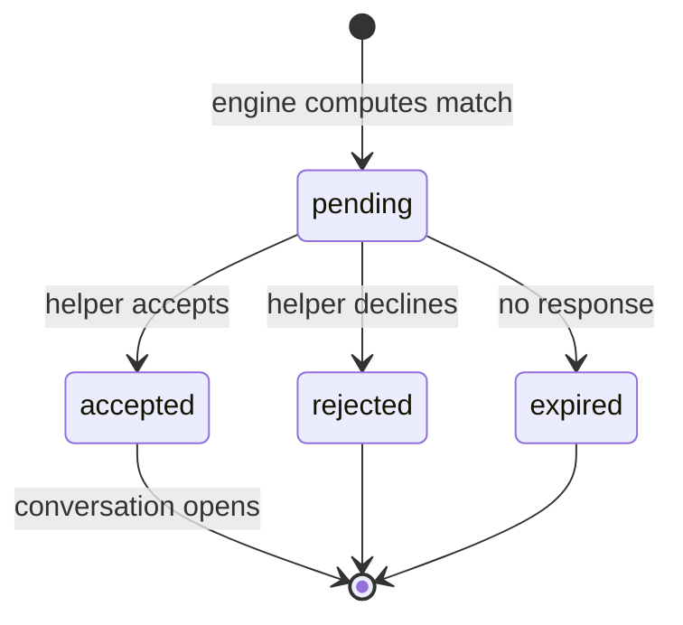
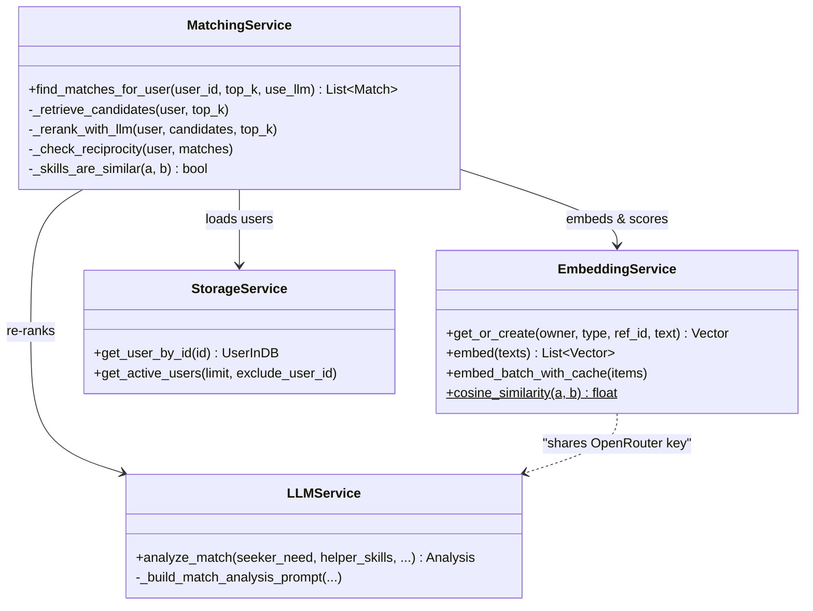

# KnowledgeX

A reciprocal **skill-exchange platform** that connects people who want to learn with those who can
teach — collaborative learning through skill bartering instead of money. A Python developer who
wants to learn UI/UX design is matched with a designer who wants to learn programming, and the two
exchange knowledge directly.

> Built at the **NexHacks** hackathon.

## Overview

Users describe what they can teach and what they want to learn through a short AI-guided chat. A
two-layer matching engine then finds complementary partners — semantic vector search to surface
candidates, followed by an LLM pass that judges and re-ranks them — and surfaces **reciprocal**
matches where both people can help each other. Connected users coordinate over a built-in messaging
system.

## Core Features

- **AI skill extraction** — a chat assistant extracts skills offered / needed from natural
  conversation, so there are no long onboarding forms.
- **Two-layer semantic matching** — vector embeddings find candidates, then an LLM re-ranks them and
  flags reciprocal (mutually beneficial) pairs.
- **Messaging** — connected users coordinate sessions and exchange resources, with polling-based
  updates.
- **Profiles** — each user maintains skills offered, skills needed, bio, and location.

## Architecture



### Stack
- **Frontend:** React 18 + React Router + Tailwind CSS. Talks to the backend at
  `http://localhost:8000/api` with a bearer token stored in `localStorage`.
- **Backend:** FastAPI + `asyncio`, MongoDB via Motor, Pydantic for models/settings, JWT auth.
- **AI:** All model calls go through **OpenRouter**. The LLM is **Google Gemma**
  (`google/gemma-3-27b-it:free`) and embeddings are **OpenAI `text-embedding-3-small`** (1536-dim),
  called through OpenRouter's OpenAI-compatible endpoint. Embeddings are cached in the
  `embeddings_cache` MongoDB collection (keyed by a hash of the text) to avoid recomputation.

### Two-layer matching engine
1. **Layer 1 — embedding retrieval** (`backend/services/matching_service.py::_retrieve_candidates`):
   each "skill needed" and each candidate "skill offered" is embedded, and **cosine similarity**
   (`backend/utils/similarity.py`) ranks candidates. Pairs below
   `MIN_EMBEDDING_SIMILARITY = 0.4` are dropped.
2. **Layer 2 — LLM re-rank** (`_rerank_with_llm` + `backend/services/llm_service.py::analyze_match`):
   the top candidates are passed to the LLM, which judges whether the helper can really teach the
   need, returns a confidence and explanation, and adjusts the score.
3. **Reciprocity** (`_check_reciprocity`): detects pairs where each user can help the other, so the
   exchange is mutual.

The full request flow, from a user asking for matches to the ranked, reciprocity-flagged result:



## Project layout

```
backend/        FastAPI app — api/ (routes), services/, models/, core/ (config, db), utils/
frontend/       React + Tailwind single-page app
tests/          pytest + standalone integration scripts (see below)
run_server.py   entry point (uvicorn on port 8000)
```

## Data model

MongoDB collections and their relationships. Skills are **embedded** documents inside each user
(`skills_offered` / `skills_needed`), not a separate collection.



A match moves through a simple lifecycle (`MatchStatus`):



## Service design

The matching engine composes three focused services behind `MatchingService`:



## Getting started

### Prerequisites
- Python 3.10+
- Node.js 18+
- A MongoDB instance (local or MongoDB Atlas)
- An [OpenRouter](https://openrouter.ai) API key

### Backend

```bash
git clone https://github.com/chaturbandaru/KnowledgeX.git
cd KnowledgeX

python -m venv .venv
source .venv/bin/activate        # Windows: .venv\Scripts\activate
pip install -r requirements.txt

cp .env.example .env             # then edit .env with your values
python run_server.py             # serves on http://localhost:8000
```

The app loads configuration from a `.env` file in the project root (see
`backend/core/config.py`). Required and optional variables — full list in
[`.env.example`](.env.example):

```
MONGO_URL=mongodb+srv://<user>:<pass>@<cluster>/<db>   # MongoDB connection string
DATABASE_NAME=knoweldge_debt
JWT_SECRET_KEY=<a-long-random-secret>
OPENROUTER_API_KEY=<your-openrouter-key>
LLM_MODEL=google/gemma-3-27b-it:free
EMBEDDING_MODEL=openai/text-embedding-3-small
# TTC_API_KEY=<optional - Token Company compression, see below>
```

Interactive API docs are available at `http://localhost:8000/docs` once the server is running.

### Frontend

```bash
cd frontend
npm install
npm start                        # serves on http://localhost:3000
```

The frontend expects the backend at `http://localhost:8000/api`.

## Testing

```bash
pytest tests/                    # unit/contract tests (e.g. test_embeddings2.py)
```

Several files under `tests/` are **standalone integration scripts** that hit live services
(MongoDB, OpenRouter) rather than pytest cases — run them directly, e.g.:

```bash
python -m tests.test_matching
python -m tests.test_embeddings
python tests/test_import.py      # smoke test: confirms the app imports
```

## Optional: Token Company compression

The chat route can optionally compress prompts using the
[Token Company](https://pypi.org) `tokenc` SDK to reduce token usage. It is **off by default** and
not required — the app runs fine without it. To enable:

```bash
pip install tokenc          # not in requirements.txt; install separately
```

```
TTC_API_KEY=<your-token-company-key>
```

When `tokenc` is not installed or `TTC_API_KEY` is unset, compression is silently skipped.

## License

[MIT](LICENSE)
